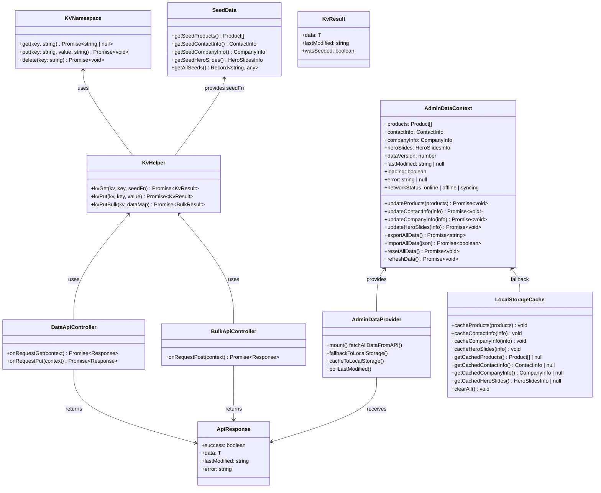
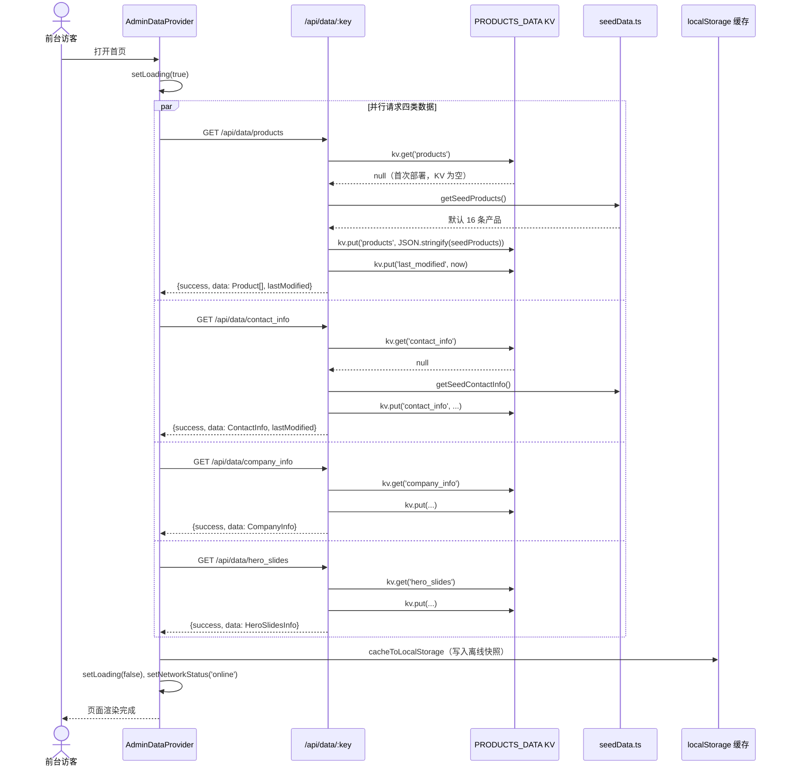
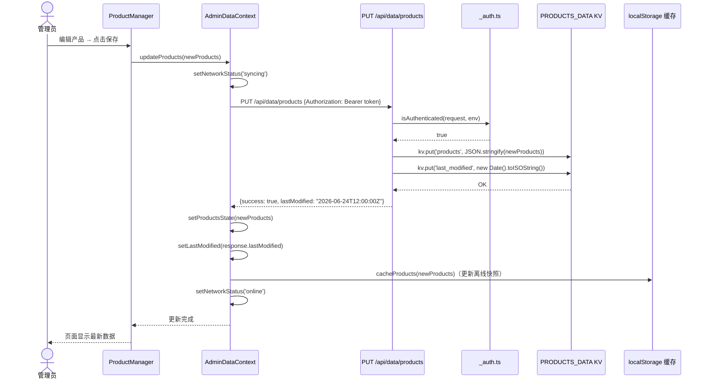
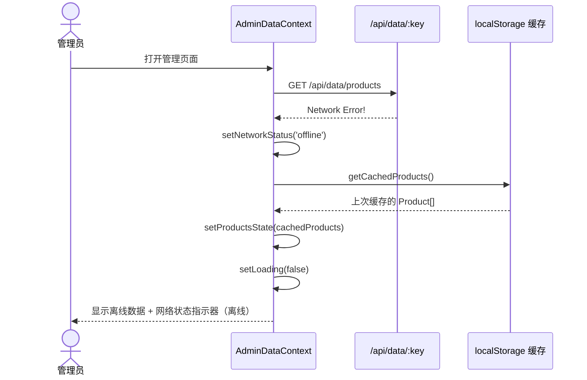
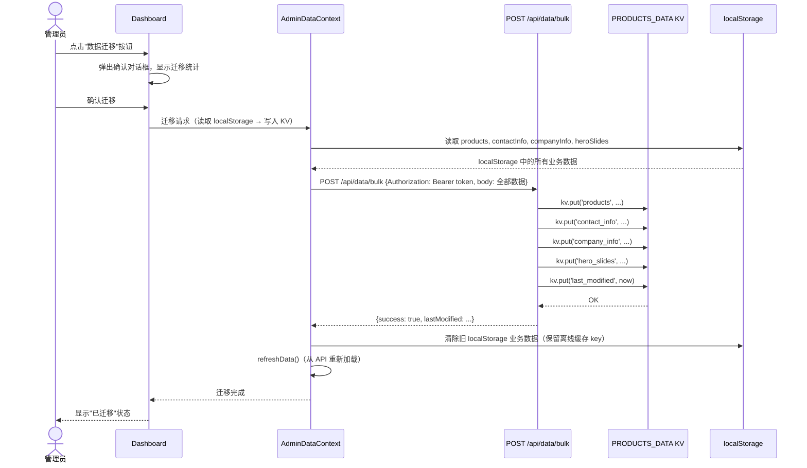
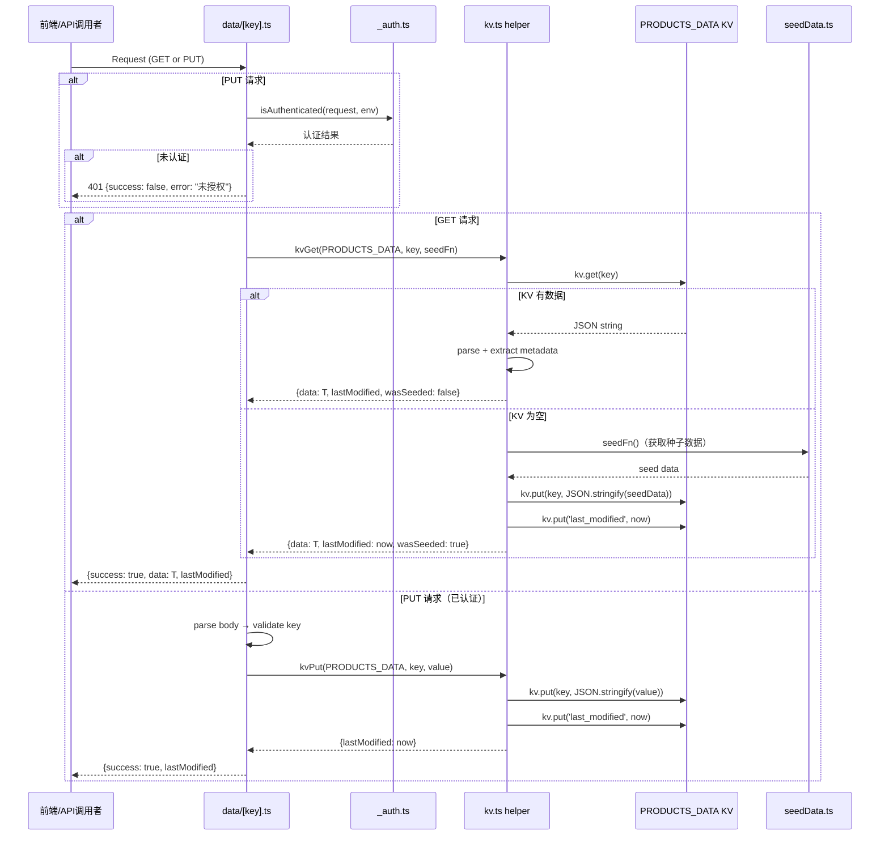
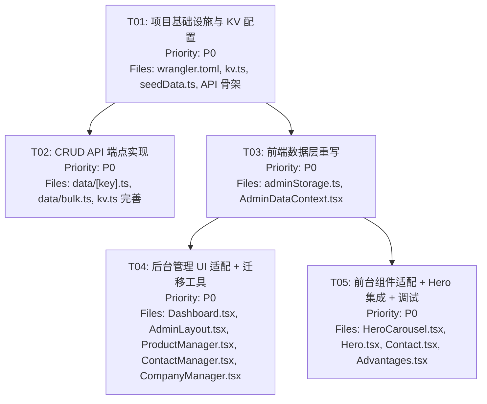

# 系统架构设计：localStorage → Cloudflare KV 数据迁移

## 项目信息

- **项目路径**: `/Users/zhangbin/WorkBuddy/2026-06-24-12-39-35/auto-parts-site`
- **技术栈**: Vite + React 18 + TypeScript + MUI + Tailwind CSS + Cloudflare Pages/Functions
- **域名**: www.altai.parts
- **PRD 文档**: `docs/prd-kv-migration.md`

---

## Part A: 系统设计

### 1. 实现方案

#### 1.1 核心技术挑战

| 挑战 | 分析 | 解决方案 |
|------|------|----------|
| **数据一致性** | 当前 localStorage 是浏览器本地存储，不同设备数据不同步 | 迁移到 Cloudflare KV 作为唯一数据源，所有设备读写同一 KV namespace |
| **API 设计** | 需新增 CRUD API 同时兼容现有询盘 API 风格 | 参照 `functions-src/api/inquiries/` 的模式，新增 `/api/data/:key` 和 `/api/data/bulk` |
| **首次部署初始化** | KV 为空时前台无数据可渲染 | GET API 在 KV 为空时自动写入种子数据并返回（PRD 方案 A） |
| **前端异步化** | 当前 AdminDataContext 所有操作是同步的 localStorage 读写 | 重写为 async：mount 时 fetch API，写入时 PUT API 后更新 React state |
| **离线兜底** | 网络异常时前台不能完全不可用 | API 失败时 fallback 到 localStorage 缓存（P1-7） |
| **KV 最终一致性** | Cloudflare KV 写入后全球节点同步约 60 秒延迟 | 前台可接受短暂延迟；管理界面通过 `last_modified` 检测最新数据 |

#### 1.2 框架与库选型

| 选型 | 决定 | 理由 |
|------|------|------|
| **KV 存储层** | Cloudflare KV（新增 `PRODUCTS_DATA` namespace） | 项目已在 Cloudflare Pages 上，KV 是原生集成服务，无需额外后端 |
| **API 模式** | Cloudflare Pages Functions（文件路由） | 现有 `functions-src/api/` 已用此模式，保持一致性 |
| **认证** | 复用现有 `_auth.ts` + `sessionStorage token` | 已有成熟的 Bearer token 认证机制，写入端复用即可 |
| **前端数据层** | React Context + async fetch | 保持 Context 架构，内部改为 API 调用 |
| **离线缓存** | localStorage 作为 fallback 快照 | 不引入新库（如 SWR/TanStack Query），保持项目简洁 |

#### 1.3 架构模式

- **服务端**: Cloudflare Pages Functions — 无服务器函数，文件系统路由
- **客户端**: MVC 变体 — AdminDataContext 充当 Model + Controller，UI 组件为 View
- **数据流**: 单向数据流 — API → Context State → UI Components

---

### 2. 文件列表

#### 2.1 新建文件

| 文件路径 | 说明 |
|----------|------|
| `functions-src/api/data/[key].ts` | GET/PUT 单数据类型端点（公开读取 / 认证写入） |
| `functions-src/api/data/bulk.ts` | POST 批量导入端点（认证写入） |
| `functions-src/lib/kv.ts` | KV 读写辅助函数模块 |
| `functions-src/lib/seedData.ts` | KV 种子数据模块（从代码默认值自动初始化 KV） |

#### 2.2 修改文件

| 文件路径 | 改动说明 |
|----------|----------|
| `wrangler.toml` | 新增 `PRODUCTS_DATA` KV namespace binding |
| `src/admin/adminStorage.ts` | 删除 localStorage CRUD 逻辑，保留类型定义 + 种子默认值 + auth helpers；新增 localStorage fallback 缓存函数 |
| `src/admin/AdminDataContext.tsx` | 全面重写：从 localStorage 同步读写 → async API 调用 + React state 管理；增加 loading/error 状态 |
| `src/admin/Dashboard.tsx` | 导出改为调用 API bulk export；导入改为 POST /api/data/bulk；新增"数据迁移"卡片 |
| `src/admin/AdminLayout.tsx` | 右上角增加网络状态指示器（在线/离线/同步中） |
| `src/admin/ProductManager.tsx` | updateProducts 调用改为 async，增加保存时 loading 状态 |
| `src/admin/ContactManager.tsx` | updateContactInfo 调用改为 async，增加保存时 loading 状态 |
| `src/admin/CompanyManager.tsx` | updateCompanyInfo 调用改为 async，增加保存时 loading 状态 |
| `src/components/HeroCarousel.tsx` | 接收 heroSlides 参数，替换当前硬编码的静态幻灯片内容 |
| `src/components/Hero.tsx` | 传递 heroSlides 数据到 HeroCarousel |
| `src/main.tsx` | AdminDataProvider 内部已重写，入口文件无需改动（Provider 层级不变） |

#### 2.3 不改动文件

| 文件路径 | 理由 |
|----------|------|
| `functions-src/api/_auth.ts` | 认证逻辑完整，复用即可 |
| `functions-src/api/auth.ts` | 登录端点不变 |
| `functions-src/api/inquiry.ts` | 询盘提交端点不变（PRD 明确要求） |
| `functions-src/api/inquiries/` | 询盘管理端点不变 |
| `functions-src/api/track.ts` | 浏览统计端点不变 |
| `functions-src/api/image.ts` | 图片上传端点不变 |
| `functions-src/api/upload.ts` | R2 上传端点不变 |
| `src/data/products.ts` | 保留为种子数据引用（KV 初始化用） |
| `src/App.tsx` | 路由不变 |
| `src/pages/HomePage.tsx` | 通过 useAdminData() 自动获取 API 数据 |
| `src/pages/ProductsPage.tsx` | 通过 useAdminData() 自动获取 API 数据 |
| `src/pages/ProductDetailPage.tsx` | 通过 useAdminData() 自动获取 API 数据 |
| `src/components/FeaturedProducts.tsx` | 通过 useAdminData() 自动获取 API 数据 |
| `src/components/Contact.tsx` | 通过 useAdminData() 自动获取 API 数据 |
| `src/components/Advantages.tsx` | 通过 useAdminData() 自动获取 API 数据 |

---

### 3. 数据结构和接口



#### 3.1 核心类型定义

```typescript
// --- KV Key 命名规范 ---
type DataKey = 'products' | 'contact_info' | 'company_info' | 'hero_slides' | 'data_version' | 'last_modified';

// --- API 响应格式 ---
interface ApiResponse<T> {
  success: boolean;
  data?: T;
  lastModified?: string;  // ISO 8601 UTC
  error?: string;
}

// --- KV 读取结果（含种子自动初始化标记） ---
interface KvResult<T> {
  data: T;
  lastModified: string;
  wasSeeded: boolean;  // true 表示本次是首次写入种子数据
}

// --- Bulk 导入请求体 ---
interface BulkImportRequest {
  products?: Product[];
  contactInfo?: ContactInfo;
  companyInfo?: CompanyInfo;
  heroSlides?: HeroSlidesInfo;
}

// --- 前端 Context 增强接口 ---
interface AdminDataContextValue {
  // 数据
  products: Product[];
  contactInfo: ContactInfo;
  companyInfo: CompanyInfo;
  heroSlides: HeroSlidesInfo;
  dataVersion: number;
  lastModified: string | null;
  // 状态（新增）
  loading: boolean;
  error: string | null;
  networkStatus: 'online' | 'offline' | 'syncing';
  // 更新方法（改为 async）
  updateProducts: (products: Product[]) => Promise<void>;
  updateContactInfo: (info: ContactInfo) => Promise<void>;
  updateCompanyInfo: (info: CompanyInfo) => Promise<void>;
  updateHeroSlides: (info: HeroSlidesInfo) => Promise<void>;
  // 数据操作（改为 async）
  exportAllData: () => Promise<string>;
  importAllData: (json: string) => Promise<boolean>;
  resetAllData: () => Promise<void>;
  refreshData: () => Promise<void>;
}
```

---

### 4. 程序调用流程

#### 4.1 前台页面数据加载（首次访问）



#### 4.2 管理员修改产品数据



#### 4.3 网络异常 → localStorage 兜底



#### 4.4 localStorage → KV 数据迁移



#### 4.5 GET /api/data/:key API 详细流程



---

### 5. 待明确事项 (UNCLEAR)

| # | 事项 | 当前假设 | 建议 |
|---|------|----------|------|
| 1 | **HeroCarousel 前台集成**：当前 HeroCarousel 是硬编码的 5 张静态幻灯片，不读取 `heroSlides` 数据。迁移后是否需要让前台 Hero 使用 KV 中的 `hero_slides` 数据动态渲染？ | **假设：需要**。T05 会改造 HeroCarousel 接收 heroSlides prop，当 heroSlides 有 imageUrl 时动态显示，否则 fallback 到当前硬编码内容 | 建议与产品经理确认：是否将 Hero 幻灯片管理功能真正接入前台渲染 |
| 2 | **Cloudflare KV namespace ID**：wrangler.toml 中需要新增 `PRODUCTS_DATA` 的 KV namespace，需要先通过 `wrangler kv namespace create` 或 Cloudflare Dashboard 创建 | **假设：部署时创建**。wrangler.toml 先用占位符 id，部署前通过 wrangler CLI 创建实际 namespace | 需要在部署前执行 `npx wrangler kv namespace create PRODUCTS_DATA` 获取真实 id |
| 3 | **乐观锁/并发写入保护 (P1-9)**：PRD 提到 PUT 时附带 lastModified 版本号，若服务端版本更新则返回 409 | **本次不实现**。列为 P1 优先级，核心迁移 P0 先不做乐观锁，后续迭代加入 | 建议在 T02 API 实现时预留 `If-Last-Modified` header 检查的扩展点，但不强制实现 |
| 4 | **数据版本轮询 (P1-6)**：PRD 提到前端 30 秒轮询 last_modified | **本次不实现**。列为 P1，核心迁移 P0 先不做自动轮询刷新 | 建议在 AdminDataContext 预留 `pollLastModified()` 方法的扩展点 |
| 5 | **functions-src 到 functions 的构建流程**：当前 `functions/` 目录是空的，但 API 文件在 `functions-src/` 中。Cloudflare Pages Functions 需要文件在 `functions/` 目录才能识别路由 | **假设：需要构建脚本将 functions-src 复制/编译到 functions/** | 需确认当前部署流程是否已包含此步骤（deploy.sh 中未见），可能需要新增 build step |
| 6 | **DataManager.tsx**：后台有独立的 DataManager 页面（不同于 Dashboard），其功能可能与 Dashboard 的导出/导入重叠 | **假设：合并到 Dashboard**。DataManager 中的重置等功能迁移到 Dashboard 的数据备份区域 | 需确认是否保留 DataManager 作为独立页面 |

---

## Part B: 任务分解

### 6. 依赖包列表

```
本次迁移不需要新增 npm 包。
现有依赖已满足所有需求：
- react@^18.3.1: UI 框架（已有）
- @mui/material@^5.15.20: 组件库（已有）
- @cloudflare/workers-types@^4.20260624.1: KV 类型定义（已有）
- react-router-dom@^6.30.4: 路由（已有）

Cloudflare 侧新增：
- PRODUCTS_DATA KV namespace（通过 wrangler CLI 或 Dashboard 创建）
```

---

### 7. 任务列表

#### T01: 项目基础设施与 KV 配置

| 属性 | 值 |
|------|-----|
| **Task ID** | T01 |
| **Task Name** | 项目基础设施与 KV 配置 |
| **Priority** | P0 |
| **Dependencies** | 无 |
| **Source Files** | `wrangler.toml`, `functions-src/lib/kv.ts`, `functions-src/lib/seedData.ts`, `functions-src/api/data/[key].ts`（骨架）, `functions-src/api/data/bulk.ts`（骨架） |

**详细说明**：

1. **wrangler.toml**：新增 `PRODUCTS_DATA` KV namespace binding（id 使用占位符，部署前替换为真实值）
   ```toml
   [[kv_namespaces]]
   binding = "PRODUCTS_DATA"
   id = "<待创建后替换>"
   ```

2. **functions-src/lib/kv.ts**：实现 KV 读写辅助模块
   - `kvGet<T>(kv, key, seedFn?)` — 读取 KV，为空时自动调用 seedFn 写入种子数据
   - `kvPut<T>(kv, key, value)` — 写入 KV 并更新 last_modified
   - `kvPutBulk(kv, dataMap)` — 批量写入多个 key

3. **functions-src/lib/seedData.ts**：种子数据模块
   - 导出各类型的种子数据函数，与 `src/data/products.ts` 和 `src/admin/adminStorage.ts` 的默认值保持一致
   - 注意：种子数据在服务端函数中不能直接 import 前端 TS 文件（路径和构建环境不同），需要在 `functions-src/lib/seedData.ts` 中硬编码或 JSON 化默认值

4. **functions-src/api/data/[key].ts**：创建 GET/PUT 骨架文件
5. **functions-src/api/data/bulk.ts**：创建 POST 骨架文件

---

#### T02: CRUD API 端点实现

| 属性 | 值 |
|------|-----|
| **Task ID** | T02 |
| **Task Name** | CRUD API 端点实现 |
| **Priority** | P0 |
| **Dependencies** | T01 |
| **Source Files** | `functions-src/api/data/[key].ts`, `functions-src/api/data/bulk.ts`, `functions-src/lib/kv.ts`（完善）, `functions-src/lib/seedData.ts`（完善） |

**详细说明**：

1. **GET /api/data/:key**：
   - 支持的 key：`products`, `contact_info`, `company_info`, `hero_slides`, `data_version`
   - 公开访问（无需认证），前台页面需要读取数据
   - KV 为空时自动写入种子数据并返回（通过 kvGet 的 seedFn 参数）
   - 响应格式：`{ success: true, data: T, lastModified: "ISO8601" }`

2. **PUT /api/data/:key**：
   - 支持的 key：同 GET
   - 需管理员认证（复用 `_auth.ts`）
   - 接收 JSON body，写入 KV
   - 自动更新 `last_modified` key
   - 响应格式：`{ success: true, lastModified: "ISO8601" }`
   - 预留 `If-Last-Modified` header 检查扩展点（P1 乐观锁）

3. **POST /api/data/bulk**：
   - 需管理员认证
   - 接收 `{ products?, contactInfo?, companyInfo?, heroSlides? }` JSON body
   - 批量写入所有提供的 key 到 KV
   - 更新 `last_modified`
   - 响应格式：`{ success: true, lastModified: "ISO8601" }`

4. **完善 kv.ts**：增加 key 校验（只允许合法 DataKey）、错误处理、日志
5. **完善 seedData.ts**：确保服务端种子数据与前端默认值一致

---

#### T03: 前端数据层重写

| 属性 | 值 |
|------|-----|
| **Task ID** | T03 |
| **Task Name** | 前端数据层重写（核心改造） |
| **Priority** | P0 |
| **Dependencies** | T01 |
| **Source Files** | `src/admin/adminStorage.ts`, `src/admin/AdminDataContext.tsx`, `src/main.tsx`（验证） |

**详细说明**：

1. **src/admin/adminStorage.ts** 改造：
   - **删除**：所有 localStorage CRUD 函数（`getProducts/setProducts`, `getContactInfo/setContactInfo`, `getCompanyInfo/setCompanyInfo`, `getHeroSlides/setHeroSlides`, `getDataVersion/getLastModified`, `exportData/importData/resetData`）
   - **删除**：`readJSON/writeJSON/updateLastModified` 内部函数
   - **删除**：`STORAGE_KEYS` 常量（旧 key）
   - **保留**：所有类型定义（`ContactInfo`, `CompanyInfo`, `HeroSlidesInfo`, `HeroSlide`, `AdvantageInfo`, `AdminDataExport`, `LocalizedString`）
   - **保留**：所有种子默认值（`DEFAULT_CONTACT_INFO`, `DEFAULT_COMPANY_INFO`, `DEFAULT_HERO_SLIDES`, `CURRENT_DATA_VERSION`）
   - **保留**：所有 auth helpers（`isAuthenticated/getAuthToken/setAuthToken/clearAuthToken`, `ADMIN_AUTH_KEY`）
   - **保留**：`emptyLocalizedString()` helper
   - **新增**：localStorage 缓存函数（用于离线 fallback）
     - `cacheToLocalStorage(key, data)` — 写入缓存（使用新 key 前缀 `autoparts_cache_`）
     - `getCachedData(key)` — 读取缓存
     - `clearAllCache()` — 清除所有缓存

2. **src/admin/AdminDataContext.tsx** 全面重写：
   - **新增状态**：`loading`, `error`, `networkStatus`
   - **初始化**：mount 时并发 fetch 四类数据（`GET /api/data/products` 等）
   - **初始化 fallback**：API 失败时从 localStorage 缓存读取，再失败则使用种子默认值
   - **更新方法**：全部改为 async
     - `updateProducts(newProducts)` → `PUT /api/data/products`，成功后更新 state + 缓存到 localStorage
     - 同理 `updateContactInfo`, `updateCompanyInfo`, `updateHeroSlides`
   - **导出/导入**：改为 async API 调用
     - `exportAllData()` → 并发 GET 四类数据，组装 JSON
     - `importAllData(json)` → `POST /api/data/bulk`
   - **重置**：`resetAllData()` → 用种子数据 PUT 各 key
   - **刷新**：`refreshData()` → 重新从 API fetch 所有数据

3. **src/main.tsx** 验证：
   - Provider 层级不变：`BrowserRouter → HelmetProvider → LanguageProvider → AdminDataProvider → App`
   - AdminDataProvider 内部已重写为 async，入口无需改动
   - 可能需要增加全局 loading/error 处理（如全屏 spinner）

---

#### T04: 后台管理 UI 适配 + 迁移工具

| 属性 | 值 |
|------|-----|
| **Task ID** | T04 |
| **Task Name** | 后台管理 UI 适配 + 迁移工具 |
| **Priority** | P0 |
| **Dependencies** | T03 |
| **Source Files** | `src/admin/Dashboard.tsx`, `src/admin/AdminLayout.tsx`, `src/admin/ProductManager.tsx`, `src/admin/ContactManager.tsx`, `src/admin/CompanyManager.tsx`, `src/admin/DataManager.tsx` |

**详细说明**：

1. **src/admin/Dashboard.tsx**：
   - 导出按钮改为调用 async `exportAllData()`
   - 导入按钮改为调用 async `importAllData(fileContent)`
   - 新增"数据迁移"卡片：
     - 检测 localStorage 中是否存在旧格式业务数据（key: `autoparts_products` 等）
     - 状态：未迁移 / 迁移中 / 已迁移
     - 迁移按钮 → 读取 localStorage → `POST /api/data/bulk` → 成功后清除旧 localStorage key
     - 显示迁移统计（产品数、联系方式条数等）

2. **src/admin/AdminLayout.tsx**：
   - 右上角新增网络状态指示器小图标：
     - `online` → 绿色圆点
     - `offline` → 红色圆点
     - `syncing` → 黄色旋转图标
   - 从 AdminDataContext 读取 `networkStatus`

3. **src/admin/ProductManager.tsx**：
   - `handleSave` 中调用 `updateProducts()` 变为 await
   - 保存期间显示 loading 状态（保存按钮 disabled + spinner）
   - API 失败时显示 error alert

4. **src/admin/ContactManager.tsx** + **src/admin/CompanyManager.tsx**：
   - 同 ProductManager 的 async 适配模式

5. **src/admin/DataManager.tsx**：
   - 适配 async 的 `exportAllData/importAllData/resetAllData`
   - 或考虑合并到 Dashboard（见 UNCLEAR #6）

---

#### T05: 前台组件适配 + Hero 数据集成 + 最终调试

| 属性 | 值 |
|------|-----|
| **Task ID** | T05 |
| **Task Name** | 前台组件适配 + Hero 数据集成 + 最终调试 |
| **Priority** | P0 |
| **Dependencies** | T03 |
| **Source Files** | `src/components/HeroCarousel.tsx`, `src/components/Hero.tsx`, `src/components/Contact.tsx`, `src/components/Advantages.tsx`, `src/components/Navbar.tsx`, `src/pages/HomePage.tsx` |

**详细说明**：

1. **src/components/HeroCarousel.tsx**：
   - 新增 `heroSlides?: HeroSlidesInfo` prop
   - 当 heroSlides 存在且有 imageUrl 时，将 imageUrl 传入对应幻灯片作为背景图
   - 当 heroSlides 为空/无 imageUrl 时，fallback 到当前硬编码的静态内容（保持现有功能不退化）
   - 注意：当前 HeroCarousel 有 5 个幻灯片，每个有丰富内容（标题、描述、统计数据、CTA 按钮）。heroSlides 目前只有 imageUrl 字段，不能替代整个幻灯片内容。实际集成方式：用 imageUrl 作为幻灯片背景图，文字内容保持翻译系统的硬编码

2. **src/components/Hero.tsx**：
   - 从 `useAdminData()` 获取 `heroSlides`
   - 传递 `heroSlides` prop 到 HeroCarousel

3. **src/components/Contact.tsx**、**src/components/Advantages.tsx**、**src/components/Navbar.tsx**：
   - 这些组件已经使用 `useAdminData()` 获取数据
   - 主要验证：数据来源从 localStorage → API 后，组件是否正常工作
   - 增加 loading 状态处理（AdminDataContext 的 loading 为 true 时显示骨架屏或 spinner）

4. **src/pages/HomePage.tsx**：
   - 验证首页所有数据流正常（products → FeaturedProducts, companyInfo → Advantages, contactInfo → Contact, heroSlides → Hero）
   - 可能需要增加全局 loading indicator

5. **最终集成测试**：
   - 测试全部 API 端点（GET/PUT/bulk）
   - 测试前台页面数据加载
   - 测试后台管理操作（产品 CRUD、联系方式编辑等）
   - 测试 localStorage → KV 迁移流程
   - 测试离线 fallback

---

### 8. 共享知识

```
- API 响应格式统一：{ success: boolean, data?: T, lastModified?: string, error?: string }
- 认证方式：Bearer token（base64(password:expiryTimestamp)），通过 Authorization header 传递
- Token 存储：sessionStorage（autoparts_admin_token）
- KV key 命名：products, contact_info, company_info, hero_slides, data_version, last_modified
- KV namespace binding：PRODUCTS_DATA（新增），INQUIRIES_KV（已有，不变）
- 日期时间格式：ISO 8601 UTC（如 2026-06-24T12:00:00.000Z）
- localStorage 缓存 key 前缀：autoparts_cache_（区别于旧业务数据前缀 autoparts_）
- 种子数据策略：GET API 在 KV 为空时自动写入种子数据并返回（方案 A）
- 前台 GET 请求公开访问，后台 PUT/POST 请求需认证
- 询盘 API 保持不变（/api/inquiry, /api/inquiries）
- Cloudflare KV 最终一致性延迟约 60 秒，前台可接受
```

---

### 9. 任务依赖图



**说明**：T01 是所有任务的基础。T02 和 T03 可以并行开发（T02 是服务端 API，T03 是前端数据层，两者独立但都依赖 T01 的 KV 配置）。T04 和 T05 都依赖 T03 的前端数据层重写完成。
